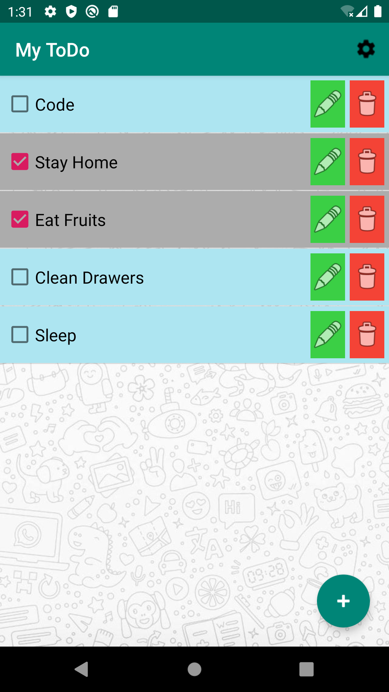

# ToDo List Android App

An android app that helps us **manage tasks** (To-Do) and provides **3 device setting features**. The storage is **persistent**, the items and their states are stored in a **SQLite database**.  
This app has 2 screens, one for the ToDo application functionality, and other for changing settings.  
In the first screen, we can **add**, **edit**, **delete** an **mark** ToDo items.  
In the second screen, i.e., the settings screen, we can **connect to a WiFi device** displayed, **adjust the device brightness** and **turn on/off flashlight**.

## ToDo List Tab

The ToDo list app looks as shown below  

### Add a new ToDo item

Click on the FAB to add a new ToDo.  

### Update a ToDo item

The edit button besides each ToDo item helps us edit that particular ToDo item.  

  

### Delete a ToDo item

To delete a ToDo, we need to click on the delete button besides that item.
In this example, I have deleted the "Sleep" ToDo item.  

## Settings Tab

### 1. Brightness

The first feature provided is to adjust the brightness. The default value of the brighness seekbar will be the current device brightness value.  

 

### 2. Flashlight

The emulator does not have a flashlight, hence this feature does not work on them. It works on a real device.

### 3. List and Connect to a WiFI Device

This feature lists all the nearby wifi devices. Upon clicking any one device, the system prompts us for the password to connect to the device. If the password entered is correct, our device gets connected to that WiFi device.  

